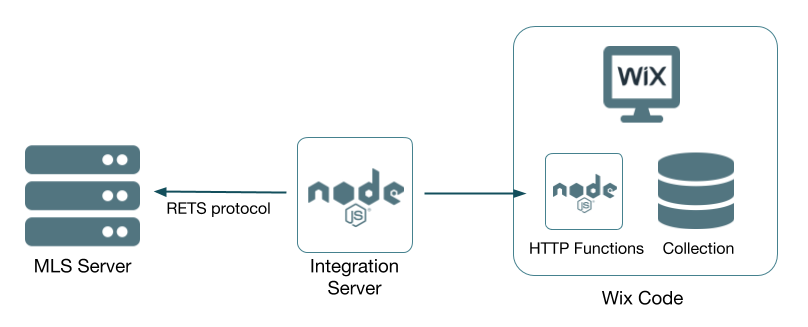
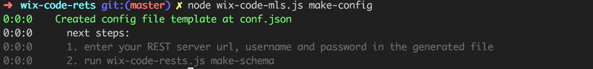
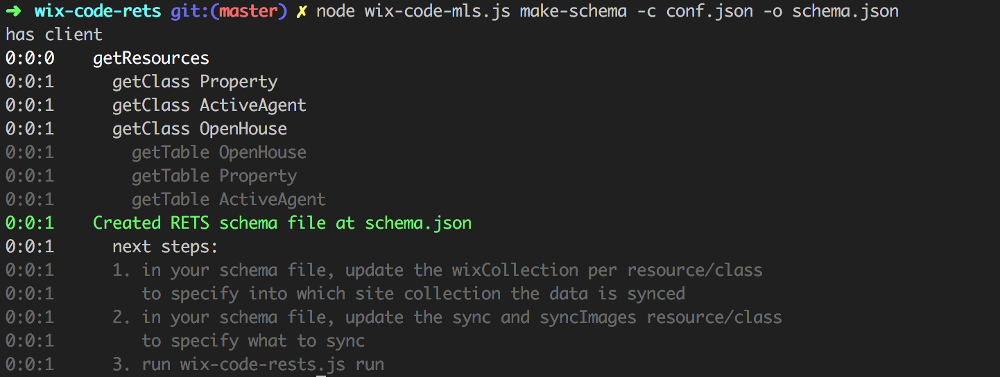
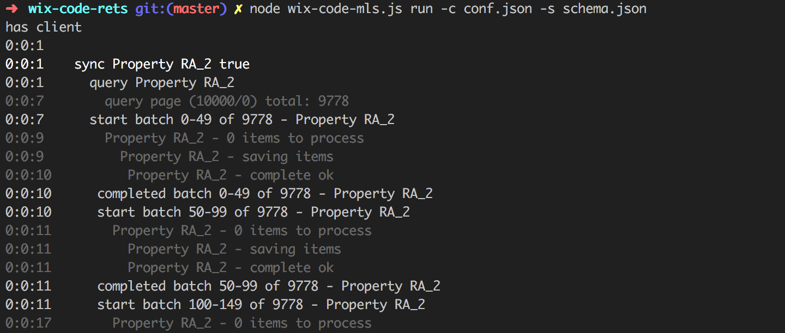

# wix-code-mls
Wix Code MLS integration using the RETS protocol

## How it works

The Integration is a node.js process (the Integration Server) that runs on your own host, using cron or a similar scheduler.
When triggered, it connects to the MLS server using the RETS protocol, connects to the Wix Code website using HTTP Functions and starts syncing data.



The actual data sync is done per MLS Table (MLS Resource & Class) to a Wix Code collection as specified in the schema file.
For each table, the integration reads all the items from the MLS server and tries to find those items in the Wix Code collection. 
For any found item, a hash of the item is compared to check if the item needs an update. 

Items that do not need an update are re-saved in the Wix Code collection to update their `_updatedDate` field.
For items that have a different hash, or do not exist in the Wix Code collection, the integration loads the item images and 
saves the item to the Wix Code collection. 

Once all items that exist on the MLS server are saved or have their `_updatedDate` updated in the Wix Code collection, the sync 
finds all items in the Wix Code collection that are older then 3 days and removed them.

## Prerequisites

In order to run the Wix Code MLS integration you will need to setup a host denoted as the Integration Server. 
On the Integration Server, you will need to install node.js, version +v8.9.4

## command line parameters

The application exposes 3 commands:
* make-config - generates the basic wix-code-rets config file
* make-schema - generates a schema file describing the RETS server Resources and Classes, and how to sync those to a Wix Code website
* run         - runs the RETS integration, importing the data into a Wix Code website

### make-config

Creates a template config file for MLS server credentials, Wix Website APIs and secret

`node wix-code-mls.js make-config [-o <output filename>]`

* -o, --output  name of the config file to generate. defaults to conf.json

Example

#### create a default config file

`node wix-code-mls.js make-config`

#### create a config file named my-config.json

`node wix-code-mls.js make-config -o my-config.json`


### make-schema

Creates the MLS resource and class schema file, used by the sync process as metadata, and to configure what to sync.
Read more at [schema](schema.conf.md).

`node ./wix-code-mls.js make-schema -c <config file> [-s <schema filename>]`

* -c, --config    [required] name of the config file to use
* -s, --schema    name of the schema file to generate. defaults to schema.json

#### create a default schema file

`node wix-code-mls.js make-schema -c conf.json`

#### create a schema file named my-schema.json using the my-conf.json config

`node wix-code-mls.js make-schema -c my-conf.json -o my-schema.json`


### make-run

Runs the sync process, with the specified filters

`node ./wix-code-mls.js run -c <config file> -s <schema filename> [-r <resource id>] [-l <class name>] [-x] [-z]`

* -c, --config    [required] name of the config file to use
* -s, --schema    [required] name of the schema file to use
* -r, --resource  limit the run to a specific resource, or multiple resources
* -l, --class     limit the run to a specific class, or multiple classes
* -x, --sync      run only sync phase
* -z, --clear     run only the clear phase

#### run a full sync

`node ./wix-code-mls.js run -c conf.json -s schema.json`

#### run sync only for the Property resource

`node ./wix-code-mls.js run -c conf.json -s schema.json -x -r Property`

or

`node ./wix-code-mls.js run -c conf.json -s schema.json --sync --resource Property`

## Setup

The setup process involves 3 stages - 
1. setting up the integration server
2. setting up the Wix Code website
3. configuring the integration
4. Initial run
5. Creating fields
6. scheduled run

### setting up the integration server

1. Clone this repo
1. Change directory to the repo 

   `cd wix-code-mls`
   
1. Run `npm install`
1. Run `node wix-code-mls.js make-config` to create a skeleton configuration file.

   

   The default filename will be `conf.json`. You can specify an alternate name using `node wix-code-mls.js make-config -o <your filename>`

   The default configuration file will have the following content
   ```json
   {
      "loginUrl": "...ENTER HERE YOUR RETS SERVER URL...",
      "username": "...RETS SERVER USERNAME...",
      "password": "...RETS SERVER PASSWORD...",
      "secret": "SOME AUTO GENERATED SECRET",
      "batchCheckUpdateState": "...WIX WEBSITE URL.../_functions-dev/batchCheckUpdateState",
      "saveItemBatch": "...WIX WEBSITE URL.../_functions-dev/saveItemBatch",
      "clearStale": "...WIX WEBSITE URL.../_functions-dev/clearStale"
    }
   ```
   
1. Update the `loginUrl`, `username` and `password` with the values you got for the MLS server.

1. Update the `batchCheckUpdateState`, `saveItemBatch` and `clearStale` with the URL of your Wix Code website

### setting up the Wix Code website

1. Open the Wix Editor for the selected website
2. If Wix Code - Developer Mode is not active, activate it from the code menu
1. In the site structure, under backend, click on the plug icon and select 'install node package'. In the dialog that opens, select the `promise-queue` package
1. click again the plus icon under backend, and create a new javascript file. Name the file `http-functions.js`. Copy the content of `wix-code/backend/http-functions.js` from this repo and paste it into the `http-functions.js` file.
1. Copy the secret from the `conf.json` file we have setup in the previous stage and paste it as the value of the secret in the `http-functions.js` file. Paste the secret value in the `secret` constant.

   ```javascript
   const secret = '...YOUR wix-code-rets SECRET, FROM THE CONFIG FILE...';
   ```
### Configuring the integration

1. Run `node wix-code-mls.js make-schema -c conf.json -o schema.json` to create the MLS schema file. 

   

   The `schema.json` file is used to tell the integration which MLS resources, MLS classes and tables to import into which Wix Collections. The generated file looks like the following - 
   
   ```json
   [
     {
       "resourceID": "resource_name",
       "className": "class_id",
       "description": "class description",
       "classTimestamp": "L_UpdateDate",
       "keyField": "L_ListingID",
       "fields": [...]
       "sync": true,
       "syncImages": true,
       "wixCollection": "resource_name"
     },
     ...
   ]  
   ```
   
   The schema fields -
   * `resourceID` - the name of the resource
   * `className` - the name of the class
   * `description` - the description of the class, from the MLS server
   * `classTimestamp` - optional timestamp field used to retrieve new elements from the MLS server
   * `keyField` - which field is the key field in the MLS server for this class
   * `fields` - the list of fields of this table (resource & class).
   * `sync` - should this table (for this resource and class) be synced to the Wix Code website?
   * `syncImages` - should we attempt to sync images for this resource / class? As some resources do not have images, trying to sync images will only slow down the integration and report some errors. It will not prevent the integration from working.
   * `filter` - optional filter to limit the sync to only a part of the MLS table. Read more at [schema](schema.conf.md).
   * `wixCollection` - the name of the collection in the Wix Code site to sync the data into. You can change this name.

1. For each `wixCollection` written in the `schema.json` file, you need to create a collection in the Wix Code website. 

   In the Wix Editor, click on database, and using the plus icon create a new collection. Name it exactly as the name is written in the 'schema.json' file for this resource / class. Set the collection permissions to site content. You do not have to create fields at this stage - we can create the fields of the collection later.

1. In some cases, you need to tweak the synchronization parameters - read more at [schema](schema.conf.md)
   
### Initial Run

To run the integration for the first time, use the command `node wix-code-mls.js run -c conf.json -s schema.json`.



The initial run can take a few hours. Subsequent runs are normally quite faster, as there is no need to sync data that has not changed.

### Create fields

After the initial run completed, the data from the MLS server will be available in the Wix Code website. You can now open the collections and you will see all the data displayed in the content manager. 

However, all field names will have a `[]` wrapper - `[image]`, `[address]`, etc.

The `[]` wrapper indicates it is field that is not formally defined. Click on the column heading, on the column menu. Select the action of Define Field and enter the field title that fits your site.

### scheduled run

The next step is to setup a scheduled run for the integration code using cron or a similar scheduler. The scheduler will need to run the same run command

```
node wix-code-mls.js run -c conf.json -s schema.json
```

## attribution

The Wix MLS integration was developed with the help of www.wixmls.com - MLS® data and information integration into the Wix.com platform by Rocket Web Labs Inc.
